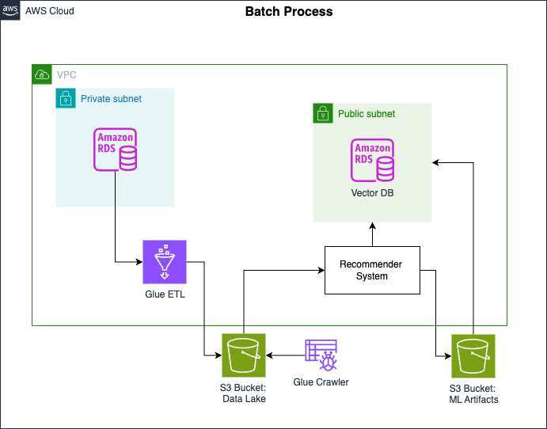

# User Activity Recommendation End-to-End Batch and Streaming Pipeline on AWS

This repository contains the implementation of an end-to-end batch and streaming data pipeline using AWS services, developed as part of my Data Engineering course. The project showcases a real-world pipeline that handles both batch and streaming data to meet stakeholder requirements, following the architectural principles learned during the course.

## Project Overview

The goal of this project is to implement batch and streaming architectures based on the following steps:

- **Batch Pipeline**: Ingest and transform user and product data from Amazon RDS (MySQL) using AWS Glue and store the transformed data in Amazon S3. This data is used to train a recommender system.
- **Vector Database**: Create a PostgreSQL database with pgvector extension to store the output embeddings from the trained model.
- **Streaming Pipeline**: Process real-time user activity data from Kinesis Data Streams, use the trained recommender model for inference, and store recommendations in an S3 bucket.

### Technologies Used

- **Amazon RDS (MySQL)**: Source database for user and product data.
- **AWS Glue**: ETL service to process and transform data.
- **Amazon S3**: Data lake for storing processed and recommendation data.
- **Amazon Kinesis Data Streams**: Ingestion service for streaming data.
- **Amazon Kinesis Data Firehose**: Delivery stream to load streaming data into S3.
- **AWS Lambda**: Inference service to apply the trained model in real-time.
- **PostgreSQL with pgvector**: Vector database for embeddings storage.
- **Terraform**: Infrastructure as Code (IaC) to provision AWS resources.

## Batch Pipeline Implementation

The batch pipeline ingests data from the `classicmodels` MySQL database in Amazon RDS, including a newly added `ratings` table, which holds user-product ratings. This data is then transformed into training data for the machine learning model and stored in S3.



### Steps

1. Connect to Amazon RDS and explore the `ratings` table.
2. Use AWS Glue to transform the data and store it in an S3 data lake.
3. Partition the transformed data for efficient access by the ML team.

## Vector Database Setup

After training the model, the output embeddings are stored in a PostgreSQL database with the pgvector extension, which is used to accelerate the retrieval of similar items during the streaming pipeline.

### Steps

1. Create the PostgreSQL vector database using Terraform.
2. Upload user and item embeddings to the vector database.

## Streaming Pipeline Implementation

The streaming pipeline ingests real-time user activity data via Kinesis Data Streams, performs model inference using a Lambda function, and stores recommendations in S3.


### Steps

1. Set up Kinesis Data Streams and Firehose to handle streaming data.
2. Use Lambda for real-time model inference and recommendation generation.
3. Store the output recommendations in the S3 recommendation bucket.

## How to Run

1. Set up the environment by running the provided setup script:  
   ```bash
   source ./scripts/setup.sh
   ```

2. Use Terraform to provision AWS resources for the batch pipeline:  
   ```bash
   cd terraform
   terraform init
   terraform apply
   ```

3. Start the AWS Glue job to transform the data:  
   ```bash
   aws glue start-job-run --job-name de-c1w4-etl-job
   ```

4. Set up the PostgreSQL vector database and upload embeddings:  
   ```bash
   terraform apply
   psql --host=<VectorDBHost> --username=postgres --password --port=5432 -f sql/embeddings.sql
   ```

5. Deploy the streaming pipeline with Terraform:  
   ```bash
   terraform apply
   ```

6. Monitor the Lambda function and check the S3 recommendation bucket for output.

## Conclusion

This project demonstrates the full data lifecycle from batch ETL processing to real-time streaming, leveraging AWS services. By combining batch and streaming architectures, this pipeline provides both training data for the recommender system and real-time recommendations based on user activity.
